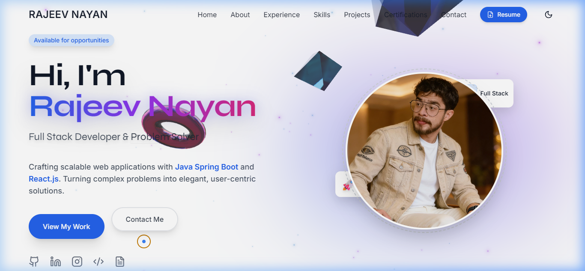

<div align="center">
  <h1 align="center">Rajeev Nayan | Software Developer Portfolio</h1>
  <p align="center">
     Creating interactive, scalable, and performance-optimized web experiences.
  </p>

  <p align="center">
    <a href="https://rajeevnayan.vercel.app/" target="_blank">
      
    </a>
    <a href="https://github.com/imrajeevnayan">
      
    </a>
    <a href="https://www.linkedin.com/in/imrajeevnayan/">
      
    </a>
    <a href="mailto:imrajeevnayan@gmail.com">
      
    </a>
  </p>

  <br />
  
</div>

---

## 🚀 Overview

Welcome to my personal portfolio repository! This project is a representation of my skills, experience, and projects as a **Full Stack Developer**. It is built with a focus on **performance**, **responsiveness**, and **modern design principles**.

The portfolio features a clean UI, dark mode support, smooth animations, and a modular architecture that makes it easy to maintain and scale.

## ✨ Key Features

- **🎨 Modern UI/UX**: Built with **React** and **Tailwind CSS** for a sleek, glass-morphic, and responsive design.
- **🌗 Dark Mode**: Fully integrated dark mode with a toggle switch, persisting user preference.
- **⚡ High Performance**: Optimized with **Code Splitting (React.lazy)** and **Lazy Loading** for images to ensure fast load times.
- **📱 Fully Responsive**: Mobile-first approach ensuring a seamless experience across all devices (Mobile, Tablet, Desktop).
- **🎞️ Smooth Animations**: Interactive elements powered by **Framer Motion** for an engaging user experience.
- **📄 Comprehensive Sections**:
  - **Hero**: Professional introduction and social links.
  - **About**: Personal background and education.
  - **Experience**: detailed professional timeline.
  - **Skills**: Categorized technical skills (Frontend, Backend, Tools).
  - **Projects**: Showcase of key projects with GitHub and Live demo links.
  - **Certifications**: Professional achievements and badges.
  - **Contact**: Functional contact form and details.

---

## 🛠️ Tech Stack

This project leverages the latest web technologies to deliver a top-tier experience:

| Category | Technologies |
|----------|-------------|
| **Frontend** | [React 18](https://reactjs.org/), [TypeScript](https://www.typescriptlang.org/) |
| **Build Tool** | [Vite](https://vitejs.dev/) (Super fast build times) |
| **Styling** | [Tailwind CSS](https://tailwindcss.com/) (Utility-first framework) |
| **Icons** | [Lucide React](https://lucide.dev/) (Beautiful & consistent icons) |
| **Animations** | [Framer Motion](https://www.framer.com/motion/) (Production-ready animations) |
| **Deployment** | [Netlify](https://netlify.com/) / [GitHub Pages](https://pages.github.com/) |

---

## � Project Structure

A quick look at the top-level files and directories you'll see in this project.

```
rajeevnayan/
├── public/              # Static assets (favicons, robots.txt, etc.)
├── src/
│   ├── components/      # Reusable React components
│   │   ├── About.tsx
│   │   ├── Certifications.tsx
│   │   ├── Contact.tsx
│   │   ├── Experience.tsx
│   │   ├── Footer.tsx
│   │   ├── Header.tsx
│   │   ├── Hero.tsx
│   │   ├── Projects.tsx
│   │   └── Skills.tsx
│   ├── App.tsx          # Main application component with Suspense & Routing
│   ├── index.css        # Global styles & Tailwind directives
│   └── main.tsx         # Entry point
├── .gitignore           # Git ignore rules
├── index.html           # HTML template
├── package.json         # Project dependencies and scripts
├── postcss.config.js    # PostCSS configuration
├── tailwind.config.js   # Tailwind CSS configuration
├── tsconfig.json        # TypeScript configuration
└── vite.config.ts       # Vite configuration
```

---

## ⚙️ Getting Started

Follow these instructions to get a copy of the project up and running on your local machine.

### Prerequisites

Ensure you have the following installed:
- [Node.js](https://nodejs.org/) (v16 or higher)
- [npm](https://www.npmjs.com/) or [yarn](https://yarnpkg.com/)

### Installation

1. **Clone the repository**
   ```bash
   git clone https://github.com/imrajeevnayan/rajeevnayan.git
   cd rajeevnayan
   ```

2. **Install dependencies**
   ```bash
   npm install
   # or
   yarn install
   ```

3. **Start the development server**
   ```bash
   npm run dev
   # or
   yarn dev
   ```
   Open [http://localhost:5173](http://localhost:5173) in your browser to see the app.

---

## 🚀 Deployment

To deploy this project to production:

1. **Build the project**
   ```bash
   npm run build
   ```
   This will create a `dist` folder with optimized static assets.

2. **Deploy**
   You can deploy the contents of the `dist` folder to any static hosting provider like Netlify, Vercel, or GitHub Pages.

---

## � Contact

I am currently open to **Full Stack Development** roles. Feel free to reach out!

- **Email**: [imrajeevnayan@gmail.com](mailto:imrajeevnayan@gmail.com)
- **LinkedIn**: [linkedin.com/in/imrajeevnayan](https://www.linkedin.com/in/imrajeevnayan/)
- **GitHub**: [github.com/imrajeevnayan](https://github.com/imrajeevnayan)

---

<p align="center">
  Made with ❤️ by <strong>Rajeev Nayan</strong>
</p>
